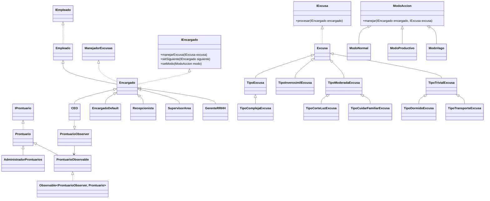

# Patrones de Diseño Identificados

## Chain of Responsibility

Podemos identificar este patrón ya que tenemos una **cadena de responsables**, en este caso, encargados. Cada encargado tiene una responsabilidad distinta sobre las excusas que puede aceptar, y puede derivarlas al siguiente encargado si no puede procesarla.

- **Handler**: `Encargado`
- **Concrete Handlers**: `Recepcionista`, `Supervisor de Área`, `Gerente de Recursos Humanos`, `CEO`
- **Request**: `Excusa`

---

## Observer

Este patrón se identifica porque necesitamos **notificar automáticamente a los CEOs** ante una acción específica.

- **Subject (Objeto observado)**: `Prontuario`
- **Observer**: `CEO`

---

## Singleton

Se utiliza este patrón para asegurarse de que **solo exista un único administrador de prontuarios**, compartido por todos los gerentes. El Singleton garantiza una única instancia global de la clase.

- **Singleton**: `AdministradorProntuarios`

---

## Strategy

Identificamos este patrón por el comportamiento **dinámico de los encargados** según el modo de acción, que puede cambiar en tiempo de ejecución.

- **Strategy**: `ModoAccion`
- **Concrete Strategies**: `ModoNormal`, `ModoVago`, `ModoProductivo`

# Diagrama de clases UML

## [Diagrama de Casos de Uso](https://www.plantuml.com/plantuml/png/ZP1VIWCn4CRVSugXJ_hGAqX1WsygzWH3TXg7viyoCocAU2gFuCKakxX2Is7VPhxlzmj9Tceerd9oYGu6La4ulXaCB1ICQt5wv3AYO8OHmn4ZxUqZ4VGQIqpa70Qh0ZwFYN2eVsi9AF5_l_VFpYqIRFQiHXbX87WaDVxvBdtsxw4fwWO-7G0iXy9sUmStlfmO1MXYRZjmditSYzH0UaOk5xhENAOpwq-OsZhqWHB5TUWhHLQJ7XSOfHPhA5ndvsexkq_L-C01ft_LIUdJYlBYtLzkHsLeEVq2)
