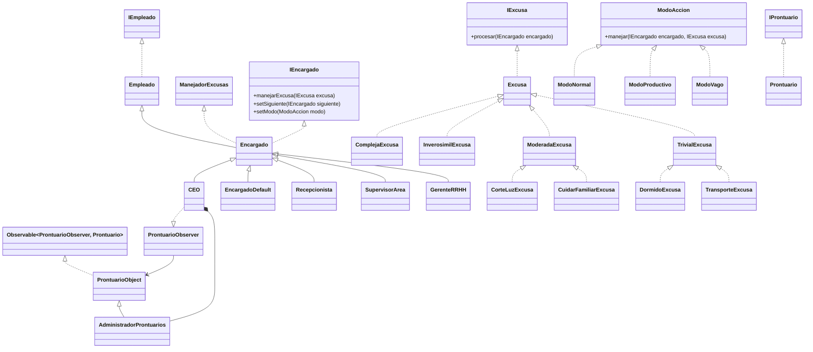

```mermaid
classDiagram
    %% Interfaces
    class IEmpleado
    class IEncargado {
        +manejarExcusa(IExcusa excusa)
        +setSiguiente(IEncargado siguiente)
        +setModo(ModoAccion modo)
    }
    class IExcusa {
        +procesar(IEncargado encargado)
    }
    class ManejadorExcusas
    class ModoAccion {
        +manejar(IEncargado encargado, IExcusa excusa)
    }
    class IProntuario
    class Observable~ProntuarioObserver, Prontuario~

    %% Clases concretas
    class Empleado
    class Encargado
    class CEO
    class EncargadoDefault
    class Recepcionista
    class SupervisorArea
    class GerenteRRHH

    class Excusa
    class ComplejaExcusa 
    class InverosimilExcusa
	class ModeradaExcusa
	class TrivialExcusa
	class CorteLuzExcusa
	class CuidarFamiliarExcusa
	class DormidoExcusa
	class TransporteExcusa
	
    class ModoNormal
    class ModoProductivo
    class ModoVago

    class AdministradorProntuarios
    class Prontuario
    class ProntuarioObject
    class ProntuarioObserver

    %% Herencias / Implementaciones
    IEmpleado <|.. Empleado
    Empleado <|-- Encargado
    ManejadorExcusas <|.. Encargado
    IEncargado <|.. Encargado

    Encargado <|-- CEO
	Encargado <|-- GerenteRRHH
    Encargado <|-- Recepcionista
    Encargado <|-- SupervisorArea
    Encargado <|-- EncargadoDefault

    IExcusa <|.. Excusa

    Excusa <|.. ComplejaExcusa
    Excusa <|.. InverosimilExcusa
    Excusa <|.. ModeradaExcusa
    Excusa <|.. TrivialExcusa
	
    TrivialExcusa <|.. DormidoExcusa
    TrivialExcusa <|.. TransporteExcusa
    ModeradaExcusa <|.. CorteLuzExcusa
    ModeradaExcusa <|.. CuidarFamiliarExcusa

    ModoAccion <|.. ModoNormal
    ModoAccion <|.. ModoProductivo
    ModoAccion <|.. ModoVago

    Observable~ProntuarioObserver, Prontuario~ <|.. ProntuarioObject
    ProntuarioObject <|-- AdministradorProntuarios
    IProntuario <|.. Prontuario
    CEO *-- AdministradorProntuarios

    ProntuarioObserver --> ProntuarioObject
    CEO ..|> ProntuarioObserver
```